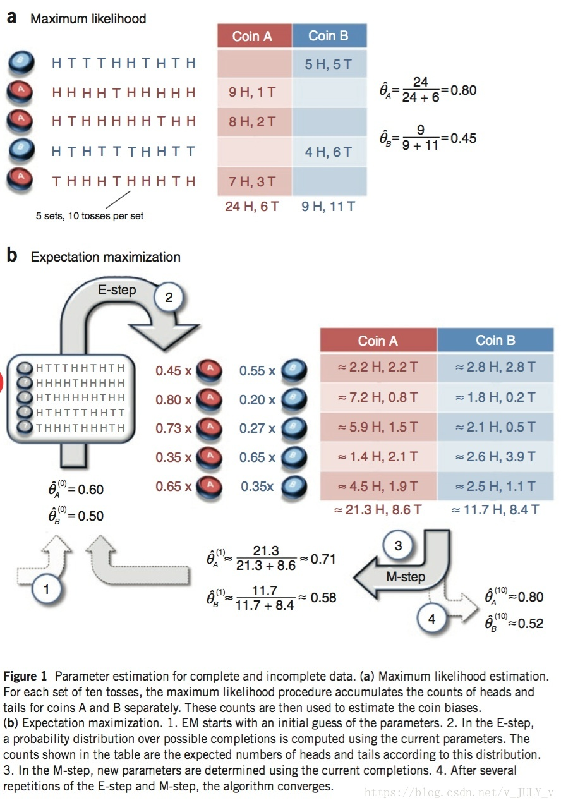

# E-M算法(Expectation-maximization algorithm)

- 前置阅读：极大似然估计,贝叶斯定理,信息熵  

### 从极大似然到EM  
在极大似然估计中我们知道，我们可以用极大似然估计来通过观测值反推分布参数从而算出数据的分布，同时极大似然估计的要求是数据的分布是**确定**的即没有隐变量的，什么叫隐变量呢？  
我们转换一下男女身高分布的问题，本来男生女生是分开的现在男生女生混合到一起去了，例如我们随机抽取男生100人，女生100人两类样本都服从正态分布但参数未知，如果两类样本分开我们就可以用极大似然的方法分布估计他们的身高分布，但是现在的情况是两类样本混合在一起了，因此随机从样本抽出一个的人的我们无法知道这个人的正确性别，因此这个情况下我们就有了性别$Z$这个隐变量了，这种情况我们就可以使用大名鼎鼎的**EM算法**来解决了。

## 举个例子
使用Nature Biotech在他的一篇EM tutorial文章《Do, C. B., & Batzoglou, S. (2008). What is the expectation maximization algorithm?. Nature biotechnology, 26(8), 897.》中，使用的一个抛硬币的例子。   
  
我们进行一个抛硬币实验，从图中可以看到如果我们知道抛的是硬币$A$还是硬币$B$那么很容易知道硬币$A$和$B$得到正面的概率记做$P(A)和P(B)$，但是现在问题来了我们不知道每次抛的是硬币$A$还是硬币$B$那么我们该怎么求$P(A)$和$P(B)$呢？我们的目标还是没变依然要求$P(A)和P(B)$但是现在多了一个隐变量$Z$表示到底硬币$A$还是硬币$B$,接下来就是**EM算法**的步骤了:  
我们在最初随机初始化一个$P(A)$和$P(B)$即图中的$\hat \theta_A^{(0)}=0.6$和$\hat \theta_B^{(0)}=0.5$，然后我们在未知硬币的情况下投掷进行五次伯努利试验每次投掷十次硬币。我们设$Z_{ik};i=1,2,3,4,5;K=A或K=B$,表示第i次试验中硬币是A和B的概率为多少

1. E-step  
拿最上面那次（第一次）为例子投掷结果为HTTTHHTHTH即五个H和五个T然后分别根据我们初始化的结果来计算两个硬币各自得到这样结果的概率。则A硬币的概率为$0.6^5*0.4^5$,而B硬币的概率为$0.5^5*5^5$，两者之比$\frac{0.6^5*0.4^5}{0.5^5*5^5}\approx\frac{0.45}{0.55}$由此第一次迭代中的$Z_{1A}=0.45，Z_{1B}=0.55$然后我们根据概率得到了图中Coin A 和Coin B表格第一行的数据，由此计算所有试验结果。  
2. M-step
在E-step我们估计了Z的分布并由此得到了A与B结果的估计，在M-step我们根据这个结构重新估计$P(A)$与$P(B)$就得到了图中的$\hat \theta_A^{(1)}=0.71$和$\hat \theta_B^{(1)}=0.58$我们就得到了新的估计。  
然后我们不停的迭代往复进行E-step与M-step,最终我们会不断的向着$P(A)$与$P(B)$逼近最终得到真实的$P(A)$与$P(B)$。  

## EM算法公式推导  
MLE: $\theta_{MLE} = {\underset {\theta}{\operatorname {arg\,max} }}\,logP(X|\theta)$  
X：obversed data  
Z：latent variable
(X,Z)：complete data  
$\theta$：parameter  
EM公式：$\theta^{(t+1)}={\underset {\theta}{\operatorname {arg\,max} }}\int_ZP(Z|X;\theta^{(t)}) logP(X,Z;\theta)dZ$   

其中：$\theta^{(t+1)}，\theta^{(t)}$为常量

### 思路1-基于KL散度  
E-step:  
$$
\begin{align}
log\,P(X;\theta) &= log\,P(X,Z;\theta)-log\,P(Z|X;\theta)\\
log\,P(X;\theta) &= log\frac{P(X,Z;\theta)}{q(Z)}-log\frac{P(Z|X;\theta)}{q(Z)}\\
E_{q(Z)}log\,P(X;\theta) &= E_{q(Z)}[log\frac{P(X,Z;\theta)}{q(Z)}]-E_{q(Z)}[log\frac{P(Z|X;\theta)}{q(Z)}]\\
\end{align}
$$
\* q(Z)为隐变量Z的分布  
left:  
$$
\begin{align}
E_{q(Z)}[log\,P(X;\theta)] &= \int_Z{q(Z)log\,P(X;\theta)dZ}\\
                 &= log\,P(X;\theta)\int_Z q(Z)dZ\\
                 &= log\,P(X;\theta)
\end{align}
$$
right:  
$$
\begin{align}
 E_{q(Z)}[log\frac{P(X,Z;\theta)}{q(Z)}]-E_{q(Z)}[log\frac{P(Z|X;\theta)}{q(Z)}]&=\int_Z q(Z)log\frac{P(X,Z;\theta)}{q(Z)}dZ\\&\quad-\int_Z q(Z)log\frac{P(Z|X;\theta)}{q(Z)}dZ\\
 &= \int_Z q(Z)log\frac{P(X,Z;\theta)}{q(Z)}dZ+D_{KL}(q||p)\\
 其中\int_Z q(Z)log\frac{P(X,Z;\theta)}{q(Z)}dZ称为ELBO(&Evidence\,Lower\,Bound)\\
 \therefore  E_{q(Z)}[log\frac{P(X,Z;\theta)}{q(Z)}]-E_{q(Z)}[log\frac{P(Z|X;\theta)}{q(Z)}]&=ELBO+D_{KL}(q||p)
\end{align}
$$
由此我们得到:
$$
\begin{align}
&log\,P(X;\theta)=ELBO+D_{KL}(q||p)\tag{1}\\
&\because D_{KL}(q||p)  \ge 0\\
&\therefore log\,P(X;\theta) \ge ELBO\quad iff\quad q=p时等号成立\\
&\therefore 当q(Z)=P(Z|X;\theta^{(t+1)})时我们得到了最大的ELBO
\end{align}
$$
三者关系如下，图中$L(\theta)$即ELBO  
  
M_step:   
$$
\begin{align}
log\,P(X;\theta) &\ge ELBO\\
\rightarrow \theta &= \mathop{argmax}_{\theta}\\
&=\mathop{argmax}_{\theta}\int_Z q(Z)log\frac{P(X,Z;\theta)}{q(Z)}dZ\\
&=\mathop{argmax}_{\theta}\int_Z P(Z|X;\theta^{(t)})log\frac{P(X,Z;\theta)}{P(Z|X;\theta^{(t)})}dZ\\
&=\mathop{argmax}_{\theta}\int_Z P(Z|X;\theta^{(t)})log\,P(X,Z;\theta)dZ
\end{align}
$$
\* $\theta^{(t)}$为常量因此变量只有$\theta$一个
由此得到:
$$
\theta^{(t+1)}=\mathop{argmax}_{\theta}\int_Z P(Z|X;\theta^{(t)})log\,P(X,Z;\theta)dZ
$$

### 思路2-基于Jensen不等式  
#### Jensen不等式
对于凹函数(如图)
  
$$
\begin{align}
&有t\in [0,1]\\
&则有f(ta+(1-t)b) \le tf(a)+(1-t)f(b)\\
&当t=\frac12时\\
&有f(\frac{a+b}{2}) \le \frac{f(a)+f(b)}{2}\\
&即f(E[x]) \le E[f(x)](图中D点小于C点)，iff\, f(x)=c时等号成立\\
\end{align}
$$

同理对于凸函数则有：$f(E[x]) \ge E[f(x)]$  
#### 推导  
$$
\begin{align}
log\,P(X;\theta) &=log\,\int_Z P(X,Z;\theta)dZ\\
&= log\,\int_Z \frac{P(X,Z;\theta)}{q(Z)}{q(Z)}dZ\\
&= log\,E_{q(Z)}[\frac{P(X,Z;\theta)}{q(Z)}]\\
&\ge E_{q(Z)}[log\frac{P(X,Z;\theta)}{q(Z)}]\tag{2}\\
&iff\quad \frac{P(X,Z;\theta)}{q(Z)}=c时等号成立\\
\end{align}
$$
仔细观察可以发现(2)式子中得到的期望和(1)式中的ELBO是相同的由此两种思路汇合都是极大化ELBO来逼近真实值，根据Jensen不等式当f(x)等于一个常数时取得等号由此可得：  
$$
\begin{align}
\frac{P(X,Z;\theta)}{q(Z)}&=c\\
q(Z)&=\frac{1}{c}P(X,Z;\theta)\\
\int_Zq(Z)dZ &= \int_Z\frac{1}{c}P(X,Z;\theta)dZ\\
1& = \frac{1}{c}P(X;\theta)\\
c&=P(X;\theta)\\
\rightarrow q(Z)&=P(Z|X;\theta)\\
\end{align}
$$
同样基于Jensen不等式的推导思路下也会得出相同的结论即当隐变量的分布$q(Z)=P(Z|X;\theta)$即等于后验时  
E-step得到最大结果，M-step就同第一种推导方法了。

## 合理性证明

要证明EM算法的合理性即证明其单调增长:$l(\theta^t) \leq l(\theta^{t+1})$

证明：

首先我们选定t时刻和t+1时刻的参数$\theta^t 和\theta^{t+1}$在选定$\theta^t$之后我们得到E-step结果:
$$
Q(\theta^t)=P(Z|X;\theta^t)
$$
然后进行M-step便得到:
$$
\begin{align}
l(\theta^{t+1})&\geq\int_ZQ(\theta^t)logP(Z,X;\theta^{t+1})\tag{3}\\
&\geq\int_ZQ(\theta^t))logP(Z,X;\theta^{t})\tag{4}\\
&=l(\theta^t)\tag{5}
\end{align}
$$
在式(3)中我们固定$Q(\theta^t)$然后变化$\theta$求$l(\theta^{t+1})$，这个过程中由于E-step得到的$Q(\theta^t)$是固定的所以无法求得$l(\theta^t)$的值而只能取得其下界的最大值即最大化**$Q(\theta^t)固定情况下的l(\theta^t)$**，因为变量$\theta$可以任取，所以由式子(3)得到式子(4)进而证明其单调性。

## 参考
1. [CSDN-如何通俗理解EM算法](https://blog.csdn.net/v_july_v/article/details/81708386)
2. [CSDN-变分推断中的ELBO(证据下界)](https://blog.csdn.net/qy20115549/article/details/93074519)
3. [BiliBili-机器学习-白板推导系列(十)-EM算法（Expectation Maximization）](https://www.bilibili.com/video/av31906558)

