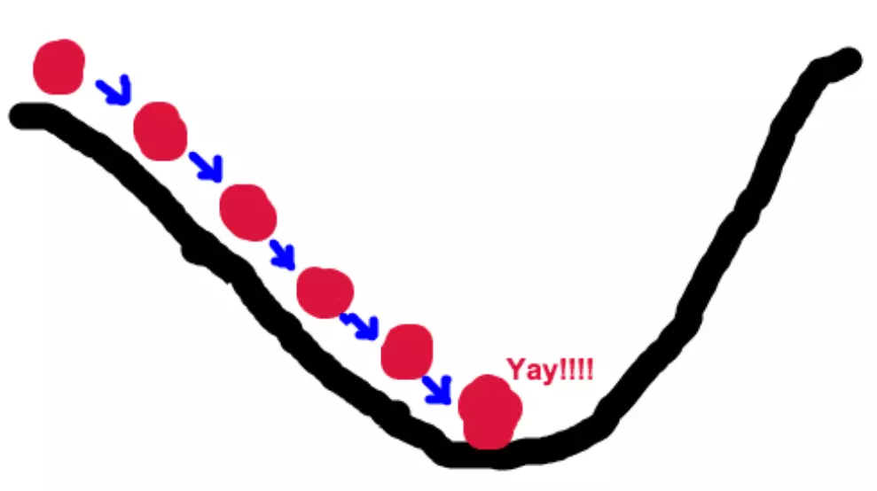
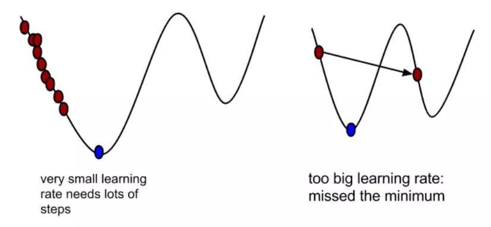
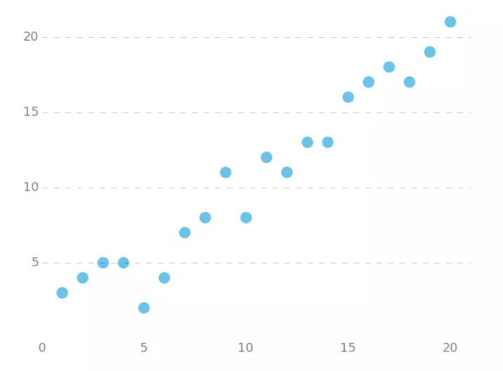
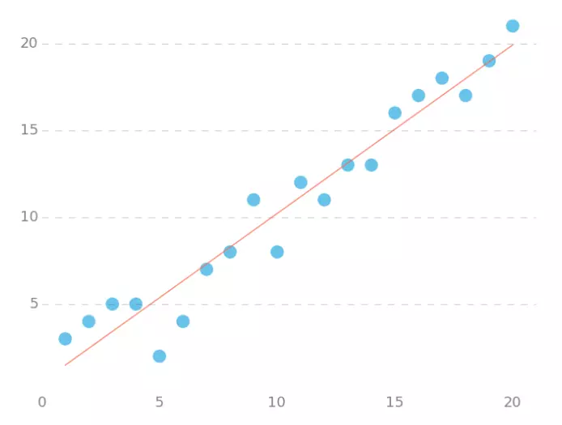

# 梯度下降(Gradient Descent)

## 实际场景

有一你上山旅行，到了山顶准备下来，结果不巧山里起了大雾完全看不见前路（曾经在黄山遇到过）此时又邻近夜晚，你必须在太阳下山之前下山也就是去到山谷。那么此时你最快的下山方法就是没往前**走一小步**就看看四周**最陡峭**的地方在哪，并且朝着那个方向再走一小步，这样就能实现在大雾可见度低的情况下最快下山。而具体过程就大概像下图所示的那样。



而**最陡峭**的地方显然不是那么好知道的，可是碰巧你有一个神奇的仪器能指明这个方向，但是每次测量都会耗费一定的时间，因此你必须决定你的每一步该有多大，选择合适的步伐，如果步伐过大可能下降的不是最合适的方向（实际上在算法来说可能的表现是错过谷底），而步伐太小可能因为耗时太长而导致太阳下山还没到谷底。

## 梯度下降

所谓的梯度下降算法的过程就和上述下山过程如出一辙，其具体公式如下：
$$
\Theta^{n+1} = \Theta^n -\alpha\nabla J(\Theta) \tag{1}
$$
其中:

$\nabla J(\Theta)$ 为我们在当前点的梯度，也就是我们上面所说的最陡峭的地方

$\alpha$ 	       为学习率，就是我们上面所说的一小步的步长

那接下来就详细说明一下梯度与学习率的含义

### 梯度

梯度实际上就是多变量微分的一般化。
下面这个例子：
$$
\begin{align}
J(\Theta) &= 0.55 -(5\theta_{1}+2\theta_{2}-12\theta_{3})\\
\nabla J(\Theta) &= <\frac{\partial J}{\partial\theta_1},\frac{\partial J}{\partial\theta_2},\frac{\partial J}{\partial\theta_3}>\\
&=<-5,-2,12>
\end{align}
$$

我们可以看到，梯度就是分别对每个变量进行微分，然后用逗号分割开，梯度是用<>包括起来，说明梯度其实一个向量。

梯度是微积分中一个很重要的概念

- 在单变量的函数中，梯度其实就是函数的微分，代表着函数在某个给定点的切线的斜率
- 在多变量函数中，梯度是一个向量，向量有方向，梯度的方向就指出了函数在给定点的上升最快的方向

梯度给出了上升最快的方向，而前面加个负号就是函数值下降最快的方向，因此在梯度下降公式中$\alpha \nabla J(\Theta)$前面是负号

### 学习率

α在梯度下降算法中被称作为**学习率**或者**步长**，意味着我们可以通过α来控制每一步走的距离。α的选择在梯度下降法中往往是很重要的！α不能太大也不能太小，太小的话，可能导致迟迟走不到最低点，太大的话，会导致错过最低点！



## 梯度下降具体例子

### 单变量函数

设有函数
$$
J(\Theta) = \theta^2
$$
则函数的梯度为
$$
\nabla J(\Theta) = 2\theta
$$
假设起始点与学习率如下
$$
\theta_0 = 1\\
\alpha = 0.4
$$
则过程如下
$$
\begin{align}
\theta_1 &= \theta_0 -\alpha \nabla J(\Theta)\\
&=1-0.4*2*1\\
&=0.2\\
\theta_2 &=\theta_1 - \alpha \nabla J(\Theta)\\
&=0.2 -0.4*0.2*2\\
&=0.04\\
\theta_3&=0.008\\
\theta_4&=0.0016
\end{align}
$$

### 多变量函数

设有函数
$$
J(\Theta) = \theta_1^2 + \theta_2^2
$$
则函数的梯度为
$$
\nabla J(\Theta) = <2\theta_2,2\theta_2>
$$
假设初始点为与学习率如下
$$
\Theta_0=(1,3)\\
\alpha=0.1
$$
则过程如下
$$
\begin{align}
\Theta_0 &= (1,3)\\
\Theta_1 &=\Theta_0-\alpha \nabla J(\Theta)\\
&=(1,3)-0.1*(2,6)\\
&=(0.8,2.4)\\
\Theta_2&=(0.8,2.4)-0.1(1.6,4.8)\\
&=(0.64,1.92)\\
.\\
.\\
.\\

\end{align}
$$

## 梯度下降算法实现

梯度下降算法的python实现，接下来我们实现一个简单的梯度下降算法，场景是一个单变量线性回归，现假设我们有如下的点



我们 用梯度下降拟合出这条直线首先我们定义我们的损失函数，此处选用均方误差损失函数
$$
J(\Theta) = \frac{1}{2m}\sum_{i=1}^M(h\Theta(x^{(i)})-y^{(i)})^2
$$

- $h\Theta(x^{(i)}) = \theta_0+\theta_1x^{(i)}$
- $2m$中的2是为了求微分是消去二次方方便计算
- $h\Theta$是预测函数
- $y^{(i)}$是真实值

具体算法如下

```python
import numpy as np

# 数据集大小
m = 20

# 定义x
X0 = np.ones((m, 1))
X1 = np.arange(1, m+1).reshape(m, 1)
X = np.hstack((X0, X1))

# 定义y
y = np.array([
    3, 4, 5, 5, 2, 4, 7, 8, 11, 8, 12,
    11, 13, 13, 16, 17, 18, 17, 19, 21
]).reshape(m, 1)

# 定义学习率 alpha
alpha = 0.01

def error_function(theta, X, y):
    '''Error function J definition.'''
    diff = np.dot(X, theta) - y
    return (1./2*m) * np.dot(np.transpose(diff), diff)

def gradient_function(theta, X, y):
    '''Gradient of the function J definition.'''
    diff = np.dot(X, theta) - y
    return (1./m) * np.dot(np.transpose(X), diff)

def gradient_descent(X, y, alpha):
    '''Perform gradient descent.'''
    theta = np.array([1, 1]).reshape(2, 1)
    gradient = gradient_function(theta, X, y)
    while not np.all(np.absolute(gradient) <= 1e-5):
        print(gradient.shape)
        theta = theta - alpha * gradient
        gradient = gradient_function(theta, X, y)
    return theta

resuult = gradient_descent(X, y, alpha)
```

运行程序最后拟合的图像如下



## 参考

1. [简书-深入浅出--梯度下降法及其实现-六尺帐篷](https://www.jianshu.com/p/c7e642877b0e)