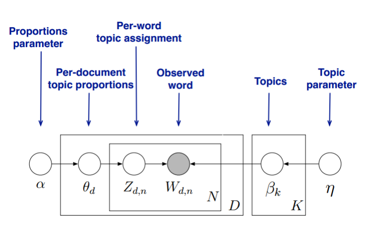

# LDA(Latent Dirichlet Allocation)

## 前置阅读

- 二项分布
- 多项式分布
- Beta分布
- Dirichlet分布
- MCMC-Gibbs Sampling
- pLSA

## 模型对于文档的认识

LDA相较于pLSA的不同之处就在于其给**主题分布**和**词分布**加了一个Dirichlet先验，也就是将原来的pLSA外面套了一层贝叶斯进而得到了如下的概率图模型。从图中可以看到LDA的由两组Dirichlet-multi共轭组成:
$$
\vec{\alpha}\rightarrow\vec{\theta_d}\rightarrow\vec{z_d}\\
\vec{\eta}\rightarrow\vec{\beta_d}\rightarrow\vec{w_k}\\
$$

其中$\alpha$是一个K维向量K是我们的主题数，也是LDA最重要的超参数，$\eta$是V维向量V是词的数量。LDA认为文档的生成过程是这样的：先从参数为$\alpha$的Dirichlet分布中采样生成主题多项式分布$\theta_d$，再从主题多项式分布中采样生成文档的主题$z_d$，若有M篇文档，那么文档-主题共轭结构即有M组；同样的词方面先从参数为$\eta$的Dirichlet分布中采样生成词多项式分布$\beta_K$而根据词的主题分类，再次采样生成词$w_k$，主题共有K个，因此主题-词共轭结构共有K组。由于主题产生词不依赖于具体的文档，因此LDA共有M+K组Dirichlet-multi共轭结构。

求解LDA模型有两种方法，一种是基于Gibbs 采样算法求解，另一种是基于变分推断EM算法进行求解。

## Gibbs Sampling 求解LDA

在Giibs 采样求解LDA的过程中$\alpha$和$\eta$是我们的先验输入，目标是得到$z_{dn}$和$w_{kn}$对应的整体$\vec{z},\vec{w}$，即文档的主题分布和词分布。由于我们是使用Gibbs采样的方法我们需要得到对应分布各个特征维度的条件分布。

具体到我们的问题，我们的所有文档联合起来形成的词向量$\vec{w}$是已知的数据，不知道的是语料库主题$\vec{z}$的分布。假如我们可以先求出联合分布$P(\vec{w},\vec{z})$，进而可以求出某一个词$w_i$对应主题特征$z_i$的条件概率分布$p(z_i=k|w_k ,z_{\neg i})$。其中，$z_{\neg i}$代表去掉下标为$i$的词后的主题分布。有了条件概率分布$p(z_i=k|w_k ,z_{\neg i})$，我们就可以进行Gibbs采样，最终在Gibbs采样收敛后得到第$i$个词的主题。

如果我们通过采样得到了所有词的主题,那么通过统计所有词的主题计数，就可以得到各个主题的词分布。接着统计各个文档对应词的主题计数，就可以得到各个文档的主题分布。

### Dirichlet 分布的归一化系数

由于下面的求解过程会用到再次先作说明根据Dirichlet分布的概率密度函数我们可以得到:
$$
\begin{align}
Dir(\vec{\theta}|\vec{\alpha})&=\frac{\Gamma(\sum_{i=1}^k\alpha_i)}{\prod_{i=1}^k\Gamma(\alpha_i)}\prod_{i=1}^{K}\theta_i^{\alpha_i-1}\\
\int_{\vec{\theta}}Dir(\vec{\theta}|\vec{\alpha})d\vec{\theta}&=\int_{\vec{\theta}} \frac{1}{\Delta(\vec{\alpha})}\prod_{i=1}^K\theta_i^{\alpha_i-1}d\vec{\theta}=1\\
\Delta(\vec{\alpha})&=\int_{\vec{\theta}}\prod_{i=1}^K\theta_i^{\alpha_i-1}d\vec{\theta}\tag{1}\\
\end{align}
$$

### 联合概率

从概率图模型出发我们可以得到LDA的模型的联合概率为：
$$
\begin{align}
P(\vec{w_k},\vec{z_d},\vec{\theta_d},\vec{\beta_k}|\vec{\alpha},\vec{\eta})&=\prod _{n=1}^MP({z_{d,n}}|\vec{\theta_d})P(\vec{\theta_d}|\vec{\alpha})P(w_{k,n}|\vec{\beta_{z_{d,n}}})P(\vec{\beta_k}|\vec{\eta})\tag{2}
\end{align}
$$
而$\vec{\theta_d},\vec{\beta_k}$是分别由$\vec{\alpha},\vec{\beta}$得到因此上述联合概率可以等价为:
$$
P(\vec{w_k},\vec{z_d}|\vec{\alpha},\vec{\eta})=P(\vec{w_k}|\vec{z_d},\vec{\eta})P(\vec{z_d}|\vec{\alpha})\tag{3}
$$
可以看出式(3)右边就是两个Dirichlet-multi共轭结构的乘积，接下来我们先求解文档-主题分布也就是$P(\vec{z_d}|\vec{\alpha})$
$$
\begin{align}
P(\vec{z_d}|\vec{\alpha})&=\int P(\vec{z_d}|\vec{\theta_d})P(\vec{\theta_d}|\vec{\alpha})d\vec{\theta_d}\\
&=\int \prod_{k=1}^K\theta_k^{n_d^{(k)}}\frac{1}{\Delta(\vec{\alpha})}\prod_{k=1}^{K}\theta_k^{\alpha_k-1}d\vec{\theta_d}\\
&=\frac{1}{\Delta(\vec{\alpha})}\int \prod_{k=1}^{K}\theta_k^{n_d^{(k)}+\alpha_k-1}d\vec{\theta_d}\\
&=\frac{\Delta(\vec{\alpha}+\vec{n_d})}{\Delta(\vec{\alpha})}\tag{4}
\end{align}
$$
其中$n_d^{(k)}$表示第$d$篇文档中属于主题$k$的词的计数，也可以直接理解为主题$k$在文档$d$中出现的次数；

$\vec{n_d}=(n_d^{(1)},n_d^{(2)},...,n_d^{(K)})$

而对于所有的文档则有：
$$
P(\vec{z}|\vec{\alpha})=\prod_{d=1}^M\frac{\Delta(\vec{\alpha}+\vec{n_d})}{\Delta(\vec{\alpha})}\tag{5}
$$
同样我们可以根据相同的方法求得$P(\vec{w_k}|\vec{z_d},\vec{\eta})$:
$$
\begin{align}
P(\vec{w_k}|\vec{z},\vec{\eta})&=\int P(\vec{w_k}|\vec{z},\vec{\beta_k})P(\vec{\beta_k}|\vec{\eta})d\vec{\beta_k}\\
&=\int \prod_{t=1}^V\beta_t^{n_k^{t}}\frac{1}{\Delta(\vec{\eta})}\prod_{t=1}^V\beta_{t}^{\eta_t-1}d\vec{\beta_k}\\
&=\frac{1}{\Delta(\vec{\eta})}\int \prod_{t=1}^V\beta^{n_k^{t}+\eta_t-1}d\vec{\beta_k}\\
&=\frac{\Delta(\vec{\eta}+\vec{n_k})}{\Delta(\vec{\eta})}\tag{6}
\end{align}
$$
其中$n_k^{(t)}$表示主题$k$中出现词$t$的计数；

$\vec{n_k}=(n_k^{(1)},n_k^{(2)},...,n_k^{(V)})$

对于所有的主题则有:
$$
P(\vec{w}|\vec{z},\vec{\eta})=\prod_{k=1}^K\frac{\Delta(\vec{\eta}+\vec{n_k})}{\Delta(\vec{\eta})}\tag{7}
$$

由此我们得到联合概率为：
$$
P(\vec{w},\vec{z}|\vec{\alpha},\vec{\eta})=\prod_{d=1}^M\frac{\Delta(\vec{\alpha}+\vec{n_d})}{\Delta(\vec{\alpha})}.\prod_{k=1}^K\frac{\Delta(\vec{\eta}+\vec{n_k})}{\Delta(\vec{\eta})}\tag{8}
$$

### Gibbs 采样条件概率

我们最终需要采样的是文档的主题分布，因此由Gibbs 采样的特点条件概率为：
$$
P(z_i=k|\vec{w},\vec{z_{\neg i}})\tag{9}
$$
注意此处的$i$是一个二维下标，$i=(d,n)$表示的是第$d$篇文档的第$n$个主题，$\neg i$表示排除$i$。

因为$i$所对应的词是可以被观察到的，因此有如下关系
$$
P(z_i=k|\vec{w},\vec{z_{\neg i}})\varpropto P(z_i=k,w_i=t|\vec{w_{\neg i}},\vec{z_{\neg i}})\tag{10}
$$
由于$w_i,z_i$只涉及文档$d$和主题$k$这两个共轭结构与其他M+K-2个共轭结构无关因此排除$w_i,z_i$不会影响M+K个的共轭结构，只会影响向量上$i$所对应的计数，因此后验为：
$$
\begin{align}
P(\vec{\theta_d}|\vec{z_{\neg i}},\vec{w_{\neg i}})=Dir(\vec{\theta_d}|\vec{n_{d,\neg i}}+\vec{\alpha})\tag{11}\\
P(\vec{\beta_k}|\vec{z_{\neg i}},\vec{w_{\neg i}})=Dir(\vec{\beta_k}|\vec{n_{k,\neg i}}+\vec{\eta})\tag{12}\\
\end{align}
$$
由此可解条件概率：
$$
\begin{align}
&P(z_i=k|\vec{w},\vec{z_{\neg i}})\varpropto P(z_i=k,w_i=t|\vec{w_{\neg i}},\vec{z_{\neg i}})\\
&=\int P(z_i=k,w_i=t,\vec{\theta_d},\vec{\beta_k}|\vec{w_{\neg i}},\vec{z_{\neg i}})d\vec{\theta_d}d\vec{\beta_k}\\
&=\int P(z_i=k|\vec{\theta_d})P(\vec{\theta_d}|\vec{z_{\neg i}},\vec{w_{\neg i}})P(w_i=t|\vec{\beta_k})P(\vec{\beta_k}|\vec{z_{\neg i}},\vec{w_{\neg i}})d\vec{\theta_d}d\vec{\beta_k}\\
&=\int P(z_i=k|\vec{\theta_d})Dir(\vec{\theta_d}|\vec{n_{d,\neg i}}+\vec{\alpha})d\vec{\theta_d}\int P(w_i=t|\vec{\beta_k})Dir(\vec{\beta_k}|\vec{n_{k,\neg i}}+\vec{\eta})d\vec{\beta_k}\\
&=\int \theta_{d,k}Dir(\vec{\theta_d}|\vec{n_{d,\neg i}}+\vec{\alpha})d\vec{\theta_d}\int \beta_{k,t}Dir(\vec{\beta_k}|\vec{n_{k,\neg i}}+\vec{\eta})d\vec{\beta_k}\\
&=E_{Dir(\vec{\theta_d}|\vec{n_{d,\neg i}}+\vec{\alpha})}[\theta_{d,k}]\cdot E_{Dir(\vec{\beta_k}|\vec{n_{k,\neg i}}+\vec{\eta})}[\beta_{k,t}]\tag{13}
\end{align}
$$
有Dirichlet分布的期望公式可得：
$$
\begin{align}
E_{Dir(\vec{\theta_d}|\vec{n_{d,\neg i}}+\vec{\alpha})}[\theta_{d,k}]=\frac{n_{d,\neg i}^{(k)}+{\alpha_k}}{\sum_{s=1}^Kn_{d,\neg i}^{(s)}+{\alpha_s}}\tag{14}\\
E_{Dir(\vec{\beta_k}|\vec{n_{k,\neg i}}+\vec{\eta})}[\beta_{k,t}]=\frac{n_{k,\neg i}^{(t)}+{\eta_t}}{\sum_{v=1}^Vn_{t,\neg i}^{(v)}+{\eta_v}}\tag{15}\\
\end{align}
$$
因此条件概率为:
$$
P(z_i=k|\vec{w},\vec{z_{\neg i}})=\frac{n_{d,\neg i}^{(k)}+{\alpha_k}}{\sum_{s=1}^Kn_{d,\neg i}^{(s)}+{\alpha_s}}\cdot\frac{n_{k,\neg i}^{(t)}+{\eta_t}}{\sum_{v=1}^Vn_{t,\neg i}^{(v)}+{\eta_v}}\tag{16}
$$

## LDA主题模型Gibbs 采样流程总结

现在我们总结下LDA Gibbs采样算法流程。首先是训练流程：

1.  选择合适的主题数$K$, 选择合适的超参数向量$\vec{\alpha},\vec{\eta}$;
2. 对应语料库中每一篇文档的每一个词，随机的赋予一个主题编号$z$;
3. 重新扫描语料库，对于每一个词，利用Gibbs采样公式更新它的topic编号，并更新语料库中该词的编号;
4. 重复第3步的基于坐标轴轮换的Gibbs采样，直到Gibbs采样收敛;
5. 统计语料库中的各个文档各个词的主题，得到文档主题分布$\vec{\theta_d}$，统计语料库中各个主题词的分布，得到LDA的主题与词的分布$\vec{\beta_k}$。

下面我们再来看看当新文档出现时，如何统计该文档的主题。此时我们的模型已定，也就是LDA的各个主题的词分布$\vec{\beta_k}$已经确定，我们需要得到的是该文档的主题分布。因此在Gibbs采样时，我们的$E_{Dirichlet(\vec{β_k)}}(\vec{β_{k,t}})$已经固定，只需要对前半部分$E_{Dirichlet(\vec{θ_d})}(\vec{θ_{d,k}})$进行采样计算即可。

现在我们总结下LDA Gibbs采样算法的预测流程：

1. 对应当前文档的每一个词，随机的赋予一个主题编号$z$;
2. 重新扫描当前文档，对于每一个词，利用Gibbs采样公式更新它的topic编号;
3. 重复第2步的基于坐标轴轮换的Gibbs采样，直到Gibbs采样收敛;
4. 统计文档中各个词的主题，得到该文档主题分布。

## 变分推断EM求解LDA

**待补全**

## 参考

1. [CSDN-通俗理解LDA主题模型-v_JULY_v](https://blog.csdn.net/v_JULY_v/article/details/41209515)
2. [博客园-文本主题模型之LDA(二) LDA求解之Gibbs采样算法-刘建平Pinard](https://www.cnblogs.com/pinard/p/6867828.html)
3. [Latent Dirichlet Allocation-David M. Blei, Andrew Y. Ng, Michael I. Jordan](http://www.jmlr.org/papers/volume3/blei03a/blei03a.pdf)