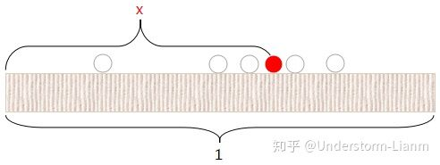

# Beta分布(Beta distribution)
P.S: B分布,Beta分布,贝塔分布都是一个概念  
## 举个例子
又是我们最喜欢的抛硬币的例子，当我们知道某个硬币正面的概率为p时可以通过二项分布很容易的计算出我在N次抛掷中得到K次正面的概率。但是现在改变一下这个问题，我们不知道硬币的概率p了，然后要去估计硬币得到正面的概率p，这个时候可能就用传统的方法我扔一千次硬币得到600次正面，和400次反面那么就可以得到p=0.6;1-p=0.4。但是，再扔一千次可能又得到不同的p例如550正面，450次反面则p=0.55;1-p=0.45,然后重复这样的实验1000次每次都扔1000次那么就会得到一个关于正面概率p的分布这个分布就是**Beta分布**即**Beta分布**是概率的分布。

## 概率密度函数  
若变量X服从参数为$\alpha$和$\beta$的Beta分布这其概率密度函数可以表示为:  
$$
f(x|\alpha,\beta)=\frac{\Gamma(\alpha+\beta)}{\Gamma(\alpha)\Gamma(\beta)}x^{\alpha-1}(1-x)^{\beta-1}
$$

其中:  
$\Gamma$表示伽马函数$\Gamma(x)=(x-1)!;x\in Z$

$\alpha$表示事件成功的次数

$\beta$表示事件失败的次数

而$\frac{\Gamma(\alpha+\beta)}{\Gamma(\alpha)\Gamma(\beta)}$可以表示为Beta函数的倒数即$\frac{1}{B(\alpha,\beta)}$;$B(\alpha,\beta)$即为Beta函数  
因此其概率密度函数可以写为：
$$
B(x|\alpha,\beta)=\frac{1}{B(\alpha,\beta)}x^{\alpha-1}(1-x)^{\beta-1}
$$

### 推导
我们从二项分布的概率质量函数出发，$P(x|n,p)={n\choose x}p^x(1-p)^{n-x}$，那么我们现在要求当中参数p的分布所以我们就去掉无关于p的部分即得到$f(p)\varpropto p^a(1-p)^{b}$，因为是概率分布所以我们乘以一个归一化系数k得
$$
\begin {align}
f(p)=k p^a(1-p)^{b}\\
\end {align}
$$
我们对其求积分可得：
$$
\begin {align}
\int_0^1 f(p)dp&=\int_0^1k p^a(1-p)^{b}dp=1\\
k&=\frac{1}{\int_0^1 p^a(1-p)^{b}dp}\\
设 a&=\alpha -1；b=\beta-1;p=t\\
\rightarrow k&=\frac{1}{\int_0^1 t^{\alpha-1}(1-t)^{\beta-1}dt}=\frac{1}{B(\alpha,\beta)}\tag{1}\\
(1)式中B(\alpha,\beta)&=\int_0^1 t^{\alpha-1}(1-t)^{\beta-1}dt即我们常见的Beta函数
\end {align}
$$
由此我们可得Beta分布的概率质量函数为:
$$
Beta(\alpha,\beta)=\frac{1}{\int_0^1 t^{\alpha-1}(1-t)^{\beta-1}dt}x^{\alpha-1}(1-x)^{\beta-1}=\frac{1}{B(\alpha,\beta)}x^{\alpha-1}(1-x)^{\beta-1}\tag{2}
$$
但是我们可以看到Beta分布的的归一化系数是长这个样子的:
$$
\frac{\Gamma(\alpha+\beta)}{\Gamma(\alpha)\Gamma(\beta)}
$$
那么$\frac{1}{B(\alpha,\beta)}$是怎么得到$\frac{\Gamma(\alpha+\beta)}{\Gamma(\alpha)\Gamma(\beta)}$的呢？ 

#### 归一化系数与gamma函数
​               
我们往长度为1的桌面上面扔一个红球，小球距离最左的距离为x，那么随机再扔n个白球则白球落在红球左边的概率就是x，那么在n个白球中就k个白球在红球左边的概率显然满足二项分布:
$$
P(k|n,x)={n\choose k}x^k(1-x)^{n-k}
$$
然后对于所有的x，k都满足这个分布那我们对上式进行积分：
$$
\int_0^1 {{n}\choose{k}}x^k(1-x)^{n-k}
$$

那么这个积分式等于多少呢？现在我们换个角度来看问题，上面的问题可以等价成往长度为1的桌面上面扔n+1个白球，我们随机抽取一个变成红球，那么显然我们无论是哪个球其变成红球的概率是$\frac{1}{n+1}$而在这个红球左边的球无论是几个的概率都是$\frac{1}{n+1}$由此可以得到下式:
$$
\int_0^1 {{n}\choose{k}}x^k(1-x)^{n-k}=\frac{1}{n+1}\\
\int_0^1x^k(1-x)^{n-k}=\frac{1}{n+1}{\frac{k!(n-k)!}{n!}}=\frac{k!(n-k)!}{(n+1)!}
$$
另$k=\alpha-1, n-k=\beta-1$又有gamma函数$\Gamma(m)=(m-1)!, m\in Z$因此Beta函数可以化为:
$$
B(\alpha,\beta)=\frac{(\alpha-1)!(\beta-1)!}{(\alpha+\beta)!}=\frac{\Gamma{(\alpha)}\Gamma(\beta)}{\Gamma(\alpha+\beta)}\tag{3}
$$
将()
$$
f(x|\alpha,\beta)=\frac{\Gamma(\alpha+\beta)}{\Gamma(\alpha)\Gamma(\beta)}x^{\alpha-1}(1-x)^{\beta-1}\tag{4}
$$

## 累计分布函数  
$$
F(x|\alpha,\beta)=\frac{B_x(\alpha,\beta)}{B(\alpha,\beta)}=I_x(\alpha,\beta)
$$
其中:  
其中$B_x(\alpha,\beta)$是不完全Βeta函数，$I_x(\alpha,\beta)$是正则不完全Beta函数。

## 期望与方差

### Beta分布的期望

$$
\begin{align}
E[X]&=\int_0^1xf(x|\alpha,\beta)dx\\
E[X]&=\int_0^1x\frac{\Gamma(\alpha+\beta)}{\Gamma(\alpha)\Gamma(\beta)}x^{\alpha-1}(1-x)^{\beta-1}dx\\
E[X]&=\frac{\Gamma(\alpha+\beta)}{\Gamma(\alpha)\Gamma(\beta)}\int_0^1x^{\alpha}(1-x)^{\beta-1}dx\\
E[X]&=\frac{\Gamma(\alpha+\beta)}{\Gamma(\alpha)\Gamma(\beta)}\frac{\Gamma(\alpha+1)\Gamma(\beta)}{\Gamma(\alpha+\beta+1)}\\
E[X]&=\frac{(\alpha+\beta-1)!}{(\alpha-1)!(\beta-1)!}\frac{(\alpha)!(\beta-1)!}{(\alpha+\beta)!}\\
E[X]&=\frac{\alpha}{\alpha+\beta}\tag{5}
\end{align}
$$

### Beta分布的方差

$$
\begin{align}
Var[X]&=E[(X-E[X])^2]\\
Var[X]&=E[X^2-2XE[X]+E[X]^2]\\
Var[X]&=E[X^2]-2E[X]E[X]+E[X]^2\\
Var[X]&=E[X^2]-E[X]^2
\end{align}
$$

$$
\begin{align}
\rightarrow E[X^2]&=\int_0^1x^2\frac{\Gamma(\alpha+\beta)}{\Gamma(\alpha)\Gamma(\beta)}x^{\alpha-1}(1-x)^{\beta-1}dx\\
E[X^2]&=\frac{\Gamma(\alpha+\beta)}{\Gamma(\alpha)\Gamma(\beta)}\int_0^1x^{\alpha+1}(1-x)^{\beta-1}dx\\
E[X^2]&=\frac{\Gamma(\alpha+\beta)}{\Gamma(\alpha)\Gamma(\beta)}\frac{\Gamma{(\alpha+1)\Gamma{(\beta)}}}{\Gamma(\alpha+\beta+1)}\\
E[X^2]&=\frac{\alpha(\alpha+1)}{(\alpha+\beta+1)(\alpha+\beta)}\\
\end{align}
$$

$$
Var[X]=\frac{\alpha\beta}{(\alpha+\beta+1)(\alpha+\beta)^2}\tag{6}
$$

## Beta分布与二项分布的关系

### 共轭先验分布

先理解"共轭"，所谓共轭即在贝叶斯定理($P(A|B)=P(A)\frac{P(B|A)}{P(B)}$ )中先验分布和后验分布是同一种分布即称之为"共轭分布"，而先验分布叫做似然函数的共轭先验分布。Beta分布就是二项分布的共轭先验分布。

### 证明

设有参数为$\theta$的二项式分布：
$$
P(x|\theta,n)={{n}\choose{x}}\theta^x(1-\theta)^{n-x}\tag{7}
$$
而参数$\theta \sim Beta(\alpha,\beta)$这有:
$$
P(\theta|\alpha,\beta)=\frac{1}{B(\alpha,\beta)}\theta^{\alpha-1}(1-\theta)^{\beta-1}\tag{8}
$$
则后验可以写为:
$$
\begin{align}
P(\theta|x,\alpha,\beta)&=P(\theta|\alpha,\beta)\frac{P(x|\theta,n)}{\int_0^1P(x,\theta|\alpha,\beta)d\theta}\\
&=P(\theta|\alpha,\beta)\frac{P(x|\theta,n)}{P(x|\alpha,\beta)}
\end{align}
$$

$$
\begin{align}
P(\theta,x|\alpha,\beta)&=P(\theta|\alpha,\beta)P(x|\theta,n)\\
&={{n}\choose{x}}\theta^x(1-\theta)^{n-x}\frac{1}{B(\alpha,\beta)}\theta^{\alpha-1}(1-\theta)^{\beta-1}\\
&=\frac{1}{B(\alpha,\beta)}{{n}\choose{k}}\theta^{x+\alpha-1}(1-\theta)^{\beta+n-x-1}\\
=&\frac{B(x+\alpha,\beta+n-x)}{B(\alpha,\beta)}{{n}\choose{k}}\frac{1}{B(x+\alpha,\beta+n-x)}\theta^{x+\alpha-1}(1-\theta)^{\beta+n-x-1}\\
&=h(x)Beta(\theta|\alpha+x,\beta+n-x)\\
\rightarrow h(x)&=\frac{B(x+\alpha,\beta+n-x)}{B(\alpha,\beta)}{{n}\choose{k}}
\end{align}
$$

$$
\begin {align}
\int_0^1P(x,\theta|\alpha,\beta)d\theta&=Beta(\alpha+x,\beta+n-x)\\
&=\frac{B(x+\alpha,\beta+n-x)}{B(\alpha,\beta)}{{n}\choose{k}}\int_0^1B(\theta|\alpha+x,\beta+n-x)d\theta\\
&=h(x)
\end {align}
$$

$$
\begin{align}
P(\theta|x,\alpha,\beta)&=P(\theta|\alpha,\beta)\frac{P(x|\theta,n)}{\int_0^1P(x,\theta|\alpha,\beta)d\theta}\\
P(\theta|x,\alpha,\beta)&=Beta(\theta|\alpha+x,\beta+n-x)\tag{9}
\end{align}
$$

可见后验分布(式(9))与先验分布(式(8))都是Beta分布，所以Beta分布是二项分布的共轭先验分布。

由于Beta是二项分布的先验概率分布所以满足贝叶斯推断即:
$$
\begin{align}
先验概率+似然(实验数据)&=后验概率\\
Beta(\alpha,\beta)+BinomCount(m,n)&=Beta(\alpha+m,\beta+n)
\end{align}
$$

### 关于Beta分布和二项分布的例子

假如现在是棒球联赛的新赛季开始，我们要预测一个球员下一个赛季的击球率，显然击球的过程是满足二项分布的，而击球率即事件成功的概率是满足Beta分布的，因此我们可以根据该球员过往的赛绩例如击中81球，丢失219球则$\alpha=81;\beta=219$显然不好直接计算先验分布那么我直接用期望代替分布就OK则$E[X]=0.27$，然后这个赛季结束了这个球员的新成绩是击中100球，丢失200球，根据贝叶斯推断得到:
$$
Beta(81,219)+BinomCount(100,200)=Beta(81+100,219+200)
$$
因此新的$E[X^{'}]=0.3$即该球员下赛季的击球率预测值为0.3，注意基于贝叶斯推断得到的概率可以发现相比于直接用该赛季的赛绩来得到预测即0.33要来的小，这是因为考虑到了先验概率的原因，所以贝叶斯推断更为严谨与准确。

## 参考
1. wiki[Beta分布](https://zh.wikipedia.org/wiki/%CE%92%E5%88%86%E5%B8%83)   

2. 知乎[Beta分布](https://www.zhihu.com/question/30269898?sort=created)

3. 知乎[[统计学进阶知识（一）]深入理解Beta分布：从定义到公式推导](https://zhuanlan.zhihu.com/p/69606875)

4. CSDN[详细公式推导](https://www.cnblogs.com/coshaho/p/9658135.html)  

   

