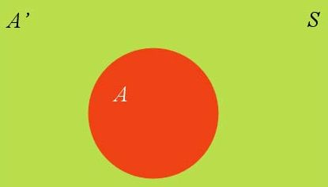
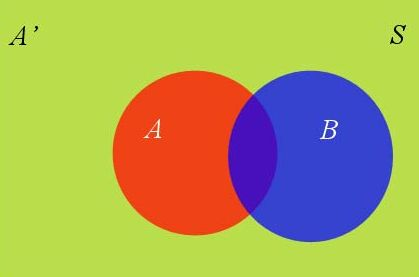

# 贝叶斯定理(Bayes' theorem)

## 举个例子  
问题：在某个学学校中男生和女生的比例是6:4，在女生中女生穿裤子的概率是0.7，而女生穿裙子的概率是0.3，男生穿裤子的概率是1，当我们走在校园中看到一个穿裤子的人那么他是女生的概率多大呢？  

答案：31.8%  

那么这个数字是如何计算的呢？按照传统的方法我们可以不停的走然后记录下遇到穿裤子的人然后记录下是否是女生，在这样记录了很多次后我们就能按照**样本/总体**的思想来算出看见一个穿裤子的人且她是女生的概率了。但是显然这种方法是非常耗费时间的而且只有如果所谓的**总体**很小的话结果依然不准确，此时就可以用到贝叶斯定理了。在这个例子中我们其实是在做一件**根据结果反推概率**的事情即**逆概率**过程。

## 贝叶斯定理公式  
$$P(A|B)=P(A)\frac{P(B|A)}{P(B)}$$  
式中：  
$P(A|B)$为在B情况下发生A的条件概率，即**后验概率**  
$P(A)$为**先验概率**  
$P(B)$为事件发生B的**全概率**或**边缘概率**(两者表达同一意思)  
$P(B|A)$为在A的情况下发生事件B的条件概率  
$\frac{P(B|A)}{P(B)}$称之为**似然**(likelihood)  
$P(A)P(B|A)$也可写作P(A,B)或者P(AB)即A与B的联合概率

设是女生为事件$A$，那么为男生就是事件$A^{'}$, 穿裤子为事件$B$那么穿裙子就为事件$B^{'}$,那么我们要求的显然是$P(A|B)$即已经看到那个人穿了裤子(事件$B$)那么这个人是女生(事件$A$)的概率是多少。  
我们需要计算两部分$P(A)$和$\frac{P(B|A)}{P(B)}$，首先$P(A)$即**先验概率**所谓先验概率就是我们在没有任何事件发生下对一件事情的概率推断，在本例子中$P(A)=0.4$，然后$\frac{P(B|A)}{P(B)}$是似然就是我们看到了一个事件$B$了然后根据这个事件去调整**先验概率**这个调整的过程就是**似然**接下来我们来说说**似然**怎么计算  
### 全概率公式    
如下图所示，在事件集合$S$内有事件$A$和事件$A^{'}$
  

这个时候$S$内出现了事件$B$  
  
那么事件$B$的概率$P(B)$的计算公式为：
$$
P(B)=P(B|A)P(A)+P(B|A^{'})P(A^{'})
$$
在离散情况下其一般式为：
$$
P(B)=\sum_{i=1}^{n}{P(B|A_{i})P(A_i)}
$$

OK现在**似然**也能计算了，我们就来算算**真正**的答案  
根据公式$P(A|B)=P(A)\frac{P(B|A)}{P(B)}$ 我们代入已知条件：  
$P(A)$是我们的**先验概率**即为女生的概率是0.4  
$P(B|A)$是在已经是女生的条件下传裤子的概率本例中为0.7
$P(B)$为学生穿裤子的概率本例中为$P(B)=P(B|A)P(A)+P(B|A^{'})P(A^{'})$即$P(B)=0.7\times0.4+0.6\times1 = 0.88$  
由此我们可以得到$P(A|B)=0.4\times{\frac{0.7}{0.88}}=0.318$  
至此我们使用贝叶斯定理解决了这个问题
## 贝叶斯定理的作用
在日常生活中我们往往做不到完全实验，比如预测明天的下雨的概率是30%但是我们不可能把明天过上许多遍后来确定这个概率，这个时候我们就可以通过贝叶斯定理我们首先有一个对于是否下雨的**先验概率**（根据经验进行一些合理的主观推断）而后在根据各自检测器所得的指标来得出一个**似然**进而得出30%这个**后验概率**  
因此可以这样对于贝叶斯定理进行理解：
$$后验概率(新信息出现后A发生的概率)＝先验概率(A发生的概率)\times可能性函数(新信息带出现来的调整)$$

## 参考 
1. [知乎-小白之通俗易懂的贝叶斯定理](https://zhuanlan.zhihu.com/p/37768413)
2. [知乎-什么是后延概率？](https://www.zhihu.com/question/315348473/answer/622044235)